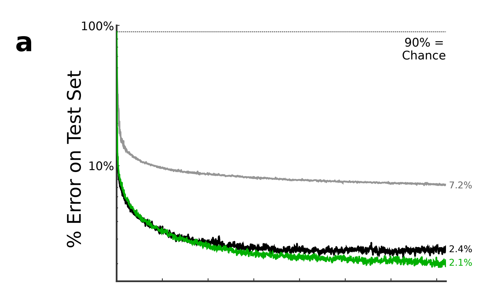
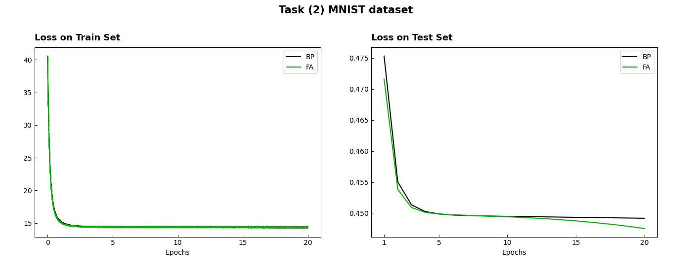

### 이 저장소(Repository)는 「Feedback Aligment를 이용한 신경망 학습 알고리즘 구현」에 대한 내용을 다루고 있습니다.

***
작성자: YAGI 

최종 수정일: 2022-11-10
+ 2022.11.10: 코드 작성 완료(Task 1 ~ 3)
***
 

***
+ 프로젝트 기간: 2022-06-27 ~ (진행 중)

***
 

***
+ 해당 프로젝트는 Timothy P. Lillicrap 외 3인의 「Random feedback weights support learning in deep neural networks」(2014)를 바탕으로 하고 있습니다.

> Timothy P. Lillicrap, Daniel Cownden, Douglas B. Tweed, Colin J. Akerman. Random feedback weights support learning in deep neural networks. [ArXiv, 1411.0247v1, 2014](https://arxiv.org/abs/1411.0247).
***
  

### 프로젝트 내용
***
&nbsp;&nbsp;
오차 역전파(Backpropagation of error)는 현재 가장 강력한 딥러닝 네트워크 학습 알고리즘이다. 하지만, 역전파는 뉴런이 기여하는 영향을 정확하게 계산하여 오류 신호를 하류의 뉴런에 할당하는데, 이는 생물학적으로 수용하기 어렵다. Timothy P. Lillicrap 외 3인은 역전파에서 사용하는 가중치의 전치 대신, '무작위 시냅스 가중치(random synaptic weights)'를 오류 신호와 곱하여 영향을 할당하는 Feedback Alignment 알고리즘(이하 FA)을 제시하였다. 나아가, 특정 작업에 대한 FA 알고리즘의 성능을 역전파 알고리즘과 비교하여 확인하였다. 성능 비교는 
*Task (1) 선형 함수 근사*, *Task (2) MNIST 데이터셋*, *Task (3) 비선형 함수 근사*를 통해 이루어졌다. 세 Task 모두 손실함수로, $L = (1/2)e^Te$를 사용하며, $e = y^* - y$로, $e$는 예측과 실제 출력의 차이이다. **본 프로젝트는 앞선 세 Task를 구현하는 것을 목표로 한다.**

 

**Task (1) Linear function approximation**

&nbsp;&nbsp;
30-20-10 선형 네트워크가 선형 함수, $T$를 근사하도록 학습한다. 입·출력 학습 쌍은 $x ~ N(μ=0, ∑=I)$으로 $y^* = Tx$를 통해 생성한다. 목표 선형 함수 $T$는 40차원 공간의 벡터를 10차원으로 매핑하였으며, $[-1, 1]$ 범위로부터 균일하게 추출하였다. 오차 역전파의 네트워크 가중치 $W_0$, $W$는 $[-0.01, 0.01]$에서 균일하게 추출하여 초기화 하였다. FA의 random feedback weight인 $B$는 균일(uniform) 분포 $[-0.5, 0.5]$에서 추출 한다. 각 알고리즘의 학습률, η는 학습 속도의 최적화를 위해 수동 탐색(manual search)을 통해 선택하였다. figure 1은 네 알고리즘의 선형 함수에 대한 손실 변화를 제시한 것으로 'shallow' 학습(옅은 회색), 강화 학습(어두운 회색), 오차 역전파(검정), 그리고 피드백 정렬(초록)이다.

 

**figure 1.** Error on Test Set of Paper's Task (1) Linear function approximation

 

&nbsp;&nbsp;
본 프로젝트에서는 학습률을 0.001, 배치 크기는 32로 설정하였으며, Epoch은 1,000회 수행하였다. 데이터셋의 경우 입·출력 데이터 모두 *Min-Max 정규화* 전처리를 진행하였다. figure 2는 학습 및 테스트 데이터셋에 대한 오차 역전파와 FA의 선형 함수 근사의 손실 변화를 시각화한 것으로 오차 역전파(검정), FA(초록)이다.

 

**figure 2.** Error of Project's Task (1) Linear function approximation

  

**Task (2) MNIST dataset**

&nbsp;&nbsp;
표준 시그모이드 은닉과 출력 유닛(즉, $σ(x) = 1/(1+exp(-x))$)의 784-1000-10 네트워크는 0-9의 필기 숫자 이미지를 분류하도록 학습되었다. 네트워크는 기본 [MNIST 데이터셋](https://yann.lecun.com/exdb/mnist/) 60,000개 이미지로 학습되었으며, 성능 측정은 10,000개의 이미지 테스트 셋을 사용하였다. 학습률은 $η = 10^{-3}$ 그리고 *weight decay*는 $α = 10^{-6}$이 사용되었다. figure 3은 10,000개의 MNIST 테스트 셋에 대한 오차 역전파(검정), FA(초록)의 손실 곡선을 제시한 것이다.

 

**figure 3.** Error on Test Set of Paper's Task (2) MNIST dataset

 

&nbsp;&nbsp;
본 프로젝트에서는 배치 크기 32로 설정하고 Epoch은 20회 수행하였다. 입·출력 데이터 모두 *Min-Max 정규화* 전처리를 진행하였다. *weight decay*는 사용하지 않았다. 네트워크 가중치는 $[-0.01, 0.01]$ 범위에서 균일하게 추출하여 초기화하였다. figure 4는 MNIST 학습 및 테스트 데이터셋에 대한 오차 역전파와 FA의 선형 함수 근사의 손실 변화를 시각화한 것으로 오차 역전파(검정), FA(초록)이다.

 

**figure 4.** Error of Project's Task (2) MNIST dataset

  

**Task (3) Nonlinear function approximation**
***

  

### Getting Started
***
본문
***

  

### License
***
This project is licensed under the terms of the [MIT license](https://github.com/YAGI0423/feedback_alignment/blob/main/LICENSE).
***